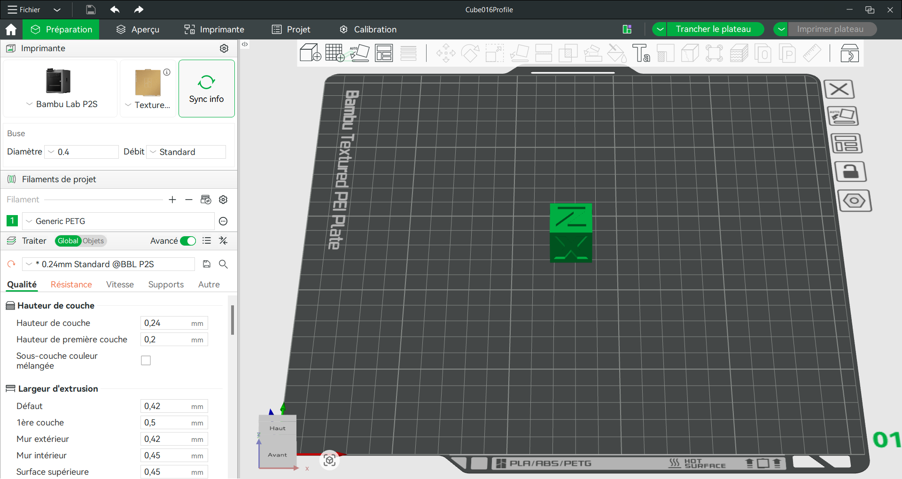

# Journal du 27 aout 2026 rédigé par BAMAZE Essonan
## fait aujourd'hui
- généralité sur la modelisation 3D
- parametrage et impression de  la prémière couche d'un cube
## Apprises 
### decouverte des fablabs 
  #### atelier de modelisation 3D
- role du slicer
- parametrage clé: couche, temperature, vitesse, rétraction 
- manipulation de base sur le logiciel bambu studuo
- 
> #### decoupe lasers:
- réalisation de la carte visite (nom, prénom, profession et contact)
- 
> #### Atelier électronique
##### le cyberPi
- le cyberPi
##### capteur et actionneur
- les capteurs mesurent les grandeurs 
- les actionneurs réagissent à la commande
##### mblock
- programmer de base un cyberPi
## Logiciel utilisé
- Bambu studuo
- Prusaslicer
- Fusion client
- mblock & CH34X_install_windows_driver