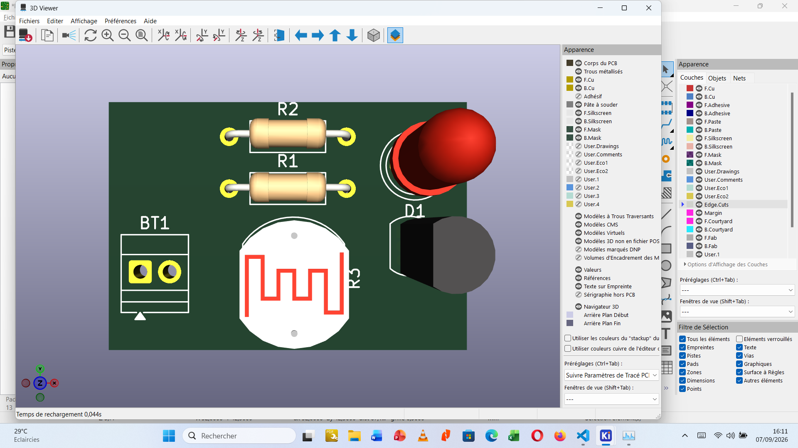
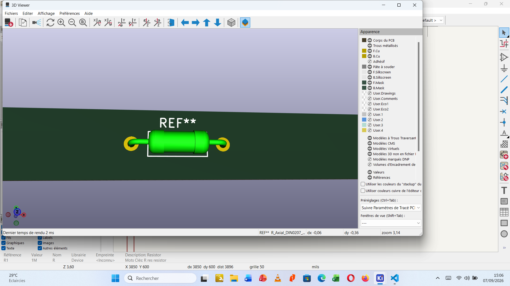
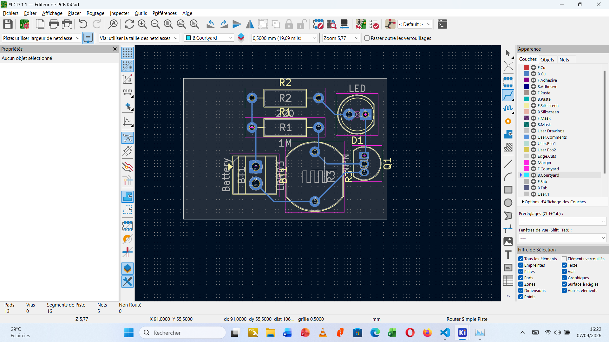

# Journal — lundi 07 septembre 2026 (rédigé par : BAMAZE Essonana)

## Fait aujourd'hui

- Initiation au PCB (Printed circuit Board, ou circuit imprimé)

## Les appris du jour:

### Initiation au PCB (Printed Circuit Board, ou circuit imprimé)

- L'usage des circuits PCB permet de simplifier les circuit testé sur les plaquettes SK10. Le PCB permet donc la vulgarisation des circuits électroniques.

- Il est préférable de faire usage des circuits PCB au détriment des circuits faite sur beardboard à cause :
  - du cablage volumineux et fragile
  - connexion moin fiable
  - sensibles au vibration
  - difficile à dupliquer
- L'anatomie d'un PCB comporte:
  - Le substrat
  - Le cuivre
  - Solder mask
  - Silkscreen
  - Pads
  - Vias
  - Mounting holes

- La schématisation du PCB se fait de la façon suivante:
  - Définir clairement ce qe doitfaire le circuit
  - Choisir les composants adater
  - Réaliser le schéma électronique avant de déssiner la carte
  - Associer chaque composant à son Footprint
  - Définir les contrainttes : alimentation...

- Edition du PCB

## Logiciel utilisé:
- KiCard 